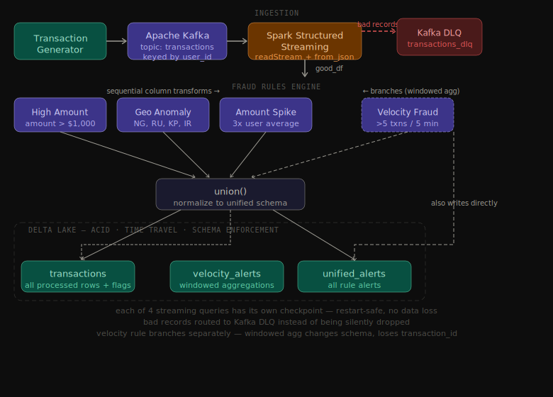

# Real-Time Fraud Detection Streaming Platform

I built this to get hands-on with streaming pipelines — my resume was light on data engineering and I wanted to actually understand how Kafka, Spark Structured Streaming, and Delta Lake fit together, not just read about them.

## Architecture



Transactions flow from a Python generator into Kafka, get picked up by Spark, pass through a fraud rules engine, and land in Delta Lake tables. Bad records (anything that fails JSON parsing) get routed to a DLQ Kafka topic instead of being silently dropped.

The rules engine applies three checks as sequential column transforms on the same DataFrame — no extra shuffles. Velocity detection branches off separately because it needs a windowed aggregation, which changes the schema.

```
Transaction Generator → Kafka → Spark Structured Streaming → Fraud Rules Engine → Delta Lake
                                                           ↘ DLQ (bad records)
```

## Fraud Detection Rules

| Rule | Description |
|------|-------------|
| High Amount | Flags transactions over $1,000 |
| Velocity Fraud | Flags users with more than 5 transactions in a 5-minute window |
| Geographic Anomaly | Flags transactions from high-risk countries (NG, RU, KP, IR) |
| Amount Spike | Flags transactions exceeding 3x the user's historical average |

## Delta Lake Tables

| Table | What's in it |
|-------|-------------|
| `delta/transactions` | All processed transactions with fraud flags |
| `delta/velocity_alerts` | Velocity fraud aggregations with window start/end |
| `delta/unified_alerts` | One row per alert across all 4 rules — normalized schema |

Bad records go to a Kafka DLQ topic (`transactions_dlq`) with a reason and timestamp attached.

The `unified_alerts` table has a consistent schema regardless of which rule fired:
`alert_id`, `transaction_id`, `user_id`, `rule_name`, `severity`, `triggered_at`, `window_start`, `window_end`

## Tech Stack

- **Apache Kafka** (Redpanda) — message streaming, partitioned by `user_id`
- **Spark Structured Streaming** — stream processing with watermarking for late data
- **Delta Lake** — ACID writes, schema enforcement, checkpoint-based fault tolerance
- **Python / PySpark** — transaction generator and fraud rules
- **Docker** — Kafka setup

## Project Structure

```
fraud-detection-streaming-platform/
├── src/
│   ├── generator/       # Transaction generator + Kafka producer
│   ├── streaming/       # Spark consumer + Delta writer
│   └── detection/       # Fraud rules
├── tests/               # Unit tests for rules
├── docs/                # Architecture diagram
└── docker/              # Docker Compose for Kafka
```

## How to Run

### Prerequisites

- Python 3.10+
- Apache Spark 3.4.1
- Docker

### Setup

```bash
git clone https://github.com/minnu-et/fraud-detection-streaming-platform.git
cd fraud-detection-streaming-platform

python3 -m venv venv
source venv/bin/activate
pip install -r requirements.txt

sudo service docker start
docker-compose -f docker/docker-compose.yml up -d
docker exec fraud-kafka rpk topic create transactions
docker exec fraud-kafka rpk topic create transactions_dlq
```

### Run

**Terminal 1 — Spark consumer:**
```bash
python -m src.streaming.spark_consumer
```

**Terminal 2 — Transaction generator:**
```bash
python -m src.generator.run_generator
```

## Things I learned the hard way

Setting `PYSPARK_PYTHON` and `PYSPARK_DRIVER_PYTHON` to `python3` explicitly — Spark kept picking up the wrong interpreter until I exported those before running anything. These are now set programmatically in `create_spark_session()` so anyone cloning the repo doesn't need to do it manually.

The `user_avg_amount` field comes from the transaction payload right now, which works for the generator but wouldn't hold up in a real system. In production this would come from a feature store or a pre-computed aggregation — it shouldn't be something the client sends.

Checkpointing needs a separate path per streaming query. Early on I had queries sharing a checkpoint location and Spark would fail on restart. Each of the four queries now has its own path in `config.yaml`.

The velocity rule produces a different schema than the main DataFrame — it loses `transaction_id` after the windowed aggregation. That's why it writes to its own Delta table and gets a `null` transaction_id when merged into `unified_alerts`.

## What I'd add next

- Streamlit dashboard reading from the Delta tables
- Stateful aggregation in Spark to compute `user_avg_amount` instead of relying on the payload
- Partitioning strategy for the Delta tables
